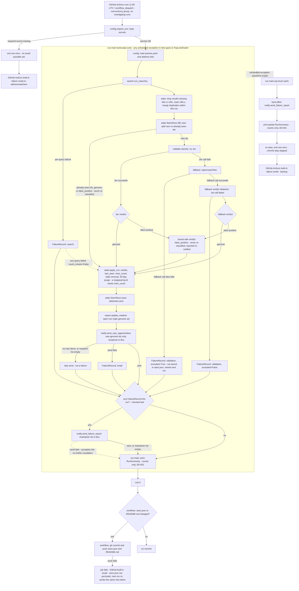

# Opportunity Watch Design

**Spec**: `.specs/features/opportunity-watch/spec.md`
**Status**: Draft

---

## Architecture Overview

Approach **B** (confirmed with the user over Approach A "single-script monolith" and Approach C "pluggable CLI framework"): a small modular package, one thin module per concern from the spec's own stories, plus a thin orchestrator. No framework - plain functions, narrow interfaces. GitHub Actions provides the only "infrastructure" (cron trigger, secrets, and the commit-back step); the Python package has no server, no database, no long-running process.



---

## Code Reuse Analysis

### Existing Components to Leverage

None - this is the first feature in a new repository. Nothing to reuse yet; this design *becomes* the reusable base for any future feature (e.g. the deferred self-serve subscription).

### Integration Points

| System | Integration Method |
| --- | --- |
| DuckDuckGo | `ddgs` package, `DDGS().text(query, max_results=N)` - confirmed against PyPI's own package docs (2026-09-22) |
| OpenRouter (Jev) | `POST` to OpenRouter's Decisions API with `model`, `state`, `questions` - confirmed against OpenRouter's own API reference (2026-09-22), see Risks below for the one open uncertainty (exact path) |
| OpenRouter (free fallback) | Standard `POST /api/v1/chat/completions` with `"model": "openrouter/free"` - confirmed against OpenRouter's own docs (2026-09-22) |
| Gmail | SMTP over `smtplib` (stdlib) + App Password, dedicated account |
| GitHub Actions secrets | `OPENROUTER_API_KEY`, `GMAIL_ADDRESS`, `GMAIL_APP_PASSWORD`, `OPPORTUNITY_RECIPIENTS` (newline-separated), `MAINTAINER_ALERTS` (newline-separated) |
| Repo state | `data/seen.json`, committed back by the **workflow** (git steps in YAML), not by Python - keeps git credentials/mechanics out of application code |

---

## Components

### `config`

- **Purpose**: Load the query list and recipient/maintainer lists; fail fast on a missing required secret.
- **Location**: `src/opportunity_watch/config.py`
- **Interfaces**:
  - `load_queries(path: str) -> list[str]` - reads `config/queries.yaml`, returns the raw `site:` query strings
  - `load_address_list(env_var: str) -> list[str]` - splits a newline-separated env var into a list, strips blanks; returns `[]` if unset (never raises - empty is a valid, spec'd state)
  - `require_env(name: str) -> str` - raises a clear `ConfigError` if a truly-required secret (`OPENROUTER_API_KEY`, `GMAIL_ADDRESS`, `GMAIL_APP_PASSWORD`) is missing
- **Dependencies**: `pyyaml`
- **Reuses**: n/a

### `search`

- **Purpose**: Run every configured query, return raw results, never let one query's failure abort the run.
- **Location**: `search.py`
- **Interfaces**:
  - `run_searches(queries: list[str]) -> tuple[list[RawResult], list[FailureRecord]]`
- **Dependencies**: `ddgs`
- **Reuses**: n/a

### `state`

- **Purpose**: Compute the stable dedup id, load/save `seen.json`, record each id's verdict, apply the 3-run stale-removal and 30-day purge rules (spec P1-AC5, 8, 12, 13, 14, 21, 22).
- **Location**: `state.py`
- **Interfaces**:
  - `opportunity_id(url: str) -> str` - SHA-256 of the normalized URL
  - `load_seen(path: str) -> SeenStore`
  - `SeenStore.diff_new(candidate_ids: list[str]) -> list[str]` - ids not present in the store
  - `SeenStore.apply_run(candidates: list[Candidate], today: date, count_misses: bool) -> RunStateResult` - updates verdict/last-seen/miss-count per candidate, returns the current open (non-stale, genuine) set and any newly-purged ids. `count_misses` is False whenever any search query failed this run, so a search outage never increments `miss_count` (P1-AC21). A reappearing id resets `miss_count` to 0 and returns to the open set without a new notification (P1-AC22)
  - `SeenStore.save(path: str) -> None`
- **Dependencies**: stdlib (`hashlib`, `json`, `datetime`)
- **Reuses**: n/a

### `validate`

- **Purpose**: Classify one candidate as genuine / false-positive via Jev, asking exactly the question in spec P1-AC20; on a Jev failure, retry via `openrouter/free`; if that also fails, report the failure so the caller excludes the candidate. **Isolates the one area of real API uncertainty** (see Risks).
- **Location**: `validate.py`
- **Interfaces**:
  - `classify(candidate: Candidate) -> ValidationResult`
  - (internal) `_call_jev(candidate) -> JevAnswer` - raises `JevCallError` on any failure
  - (internal) `_call_free_fallback(candidate) -> FallbackAnswer` - raises `ValidationFailed` on any failure
- **Dependencies**: `requests`, `OPENROUTER_API_KEY`
- **Reuses**: n/a

### `report`

- **Purpose**: Rewrite the marked section of `README.md` with the current open (non-stale) set on every run.
- **Location**: `report.py`
- **Interfaces**:
  - `render_section(open_opportunities: list[Candidate]) -> str`
  - `update_readme(path: str, rendered: str) -> bool` - returns whether the file content actually changed (drives the "commit only if changed" workflow step)
- **Dependencies**: stdlib only
- **Reuses**: n/a
- **Markers**: `<!-- OPPORTUNITIES:START -->` / `<!-- OPPORTUNITIES:END -->` in `README.md`; everything between them is replaced, everything outside is untouched.

### `notify`

- **Purpose**: Send the new-opportunity email and the failure-report email over Gmail SMTP. **Never logs a raw address** (AD-001).
- **Location**: `notify.py`
- **Interfaces**:
  - `send_new_opportunities(new_items: list[Candidate], recipients: list[str]) -> NotifyResult`
  - `send_failure_report(failures: list[FailureRecord], maintainer_list: list[str]) -> NotifyResult`
- **Dependencies**: `smtplib`, `email.mime.text` (stdlib)
- **Reuses**: shared internal `_send(subject, body, bcc_list)` helper - To: is always `GMAIL_ADDRESS`, every recipient goes in Bcc (spec P1-AC10, P2b-AC8)

### `run` (orchestrator)

- **Purpose**: Sequence every step, accumulate `FailureRecord`s from each stage, decide which emails to send, print the run summary (spec P1-AC18 / P3) to stdout - captured natively by the Actions job log, no logging library needed.
- **Location**: `run.py`
- **Interfaces**:
  - `main() -> int` (exit code; the workflow step, not this function, decides whether a non-zero code should fail the job)
- **Failure boundary (two zones, not one)**:
  1. **Secret/config loading** (`config.require_env`) - deliberately *not* wrapped. If this fails there are no Gmail credentials yet, so no email is physically possible; GitHub Actions' own built-in failure email to repo admins/watchers is the only safety net, same as before.
  2. **Everything after secrets load** (search, state/dedupe, validate, report) - wrapped in exactly **one** top-level `try/except Exception` in `main()`. On any unhandled exception here, `main()` makes a best-effort call to `notify.send_failure_report` (Gmail creds are already available at this point) describing the unexpected error, prints the partial `RunSummary` collected so far (spec P3-AC2), then re-raises so the process still exits non-zero and the job still shows failed. This is the fix for the gap identified during design review: a bug in `state`'s dedupe/diff logic, or any exception in `search.run_searches` outside its per-query handling, now reaches the maintainer-alert list instead of only GitHub's admin/watcher notification.

---

## Data Models

```python
@dataclass
class RawResult:
    title: str | None
    url: str | None
    body: str
    source_site: str
    query: str

@dataclass
class Candidate:
    id: str            # sha256 of normalized url
    title: str
    url: str
    source_site: str
    first_seen: str    # ISO date
    last_seen: str      # ISO date
    miss_count: int      # consecutive counted runs absent from search results (P1-AC21)
    verdict: Literal["genuine", "false_positive"]

@dataclass
class ValidationResult:
    candidate_id: str
    verdict: Literal["genuine", "false_positive", "failed"]
    confidence: float | None
    method: Literal["jev", "free_fallback"]
    error: str | None

@dataclass
class FailureRecord:
    type: Literal["search", "validation", "email", "config"]
    target: str          # query text or candidate url - never an email address
    message: str
    excluded: bool = False  # validation only: True = candidate dropped this run, False = recovered via fallback
    timestamp: str

@dataclass
class RunSummary:
    queries_run: int
    candidates_found: int
    validated_count: int
    new_count: int
    excluded_count: int
    failures: list[FailureRecord]
```

**Relationships**: `RawResult` → deduped/hashed into `Candidate` → each *new* `Candidate` (per `state.SeenStore.diff_new`) gets exactly one `ValidationResult`; already-seen ids were validated on the run that first saw them and are not re-validated → genuine + non-stale candidates are what `report.py` renders and what `notify.send_new_opportunities` filters to "new since last run" via `state.SeenStore.diff_new`. Any `FailureRecord` collected anywhere in the pipeline feeds `notify.send_failure_report` and the `RunSummary` log line.

**`data/seen.json` shape** (persisted `SeenStore`):

```json
{
  "opportunities": {
    "<sha256-id>": {
      "url": "...",
      "title": "...",
      "source_site": "...",
      "first_seen": "2026-09-22",
      "last_seen": "2026-09-22",
      "miss_count": 0,
      "verdict": "genuine"
    }
  }
}
```

**`config/queries.yaml` shape**:

```yaml
queries:
  # UNILA - federal, single campus (Foz do Iguaçu)
  - 'site:unila.edu.br "professor substituto"'
  - 'site:unila.edu.br "concurso público" "magistério superior"'
  # UTFPR - federal
  - 'site:utfpr.edu.br "professor substituto"'
  - 'site:utfpr.edu.br "concurso público" "magistério superior"'
  # UFPR - federal
  - 'site:ufpr.br "professor substituto"'
  - 'site:ufpr.br "concurso público" "magistério superior"'
  # IFPR - federal, multi-campus: temporary (PSS/substituto) and permanent (EBTT career)
  - 'site:ifpr.edu.br "processo seletivo simplificado"'
  - 'site:ifpr.edu.br "professor substituto" "Foz do Iguaçu"'
  - 'site:ifpr.edu.br "concurso público" "EBTT" "Foz do Iguaçu"'
  # UNIOESTE - state (Paraná), multi-campus: temporary = PSS / professor colaborador, permanent = concurso público docentes
  - 'site:unioeste.br "processo seletivo simplificado" professor "Foz do Iguaçu"'
  - 'site:unioeste.br "professor colaborador" "Foz do Iguaçu"'
  - 'site:unioeste.br "concurso público" docentes "Foz do Iguaçu"'
```

The first query of each federal institution is the user's original example; the rest are additions. `"Foz do Iguaçu"` is added only to the new queries for multi-campus institutions, to cut results from other campuses before they cost a Jev call; Jev (spec P1-AC20) remains the actual location filter.

---

## Error Handling Strategy

| Error Scenario | Handling | User Impact |
| --- | --- | --- |
| A search query raises/rate-limits | Caught in `search.run_searches`, logged as a `FailureRecord(type="search")`, remaining queries continue | None visible; surfaces only in the failure-report email if any failure occurred that run |
| Jev call fails, free-tier fallback succeeds | `validate.classify` retries via `openrouter/free`; a `FailureRecord(type="validation", excluded=False)` is still logged for the Jev-side failure even though the candidate is recovered | Report is unaffected (candidate still appears), but the maintainer failure-report email still fires for that run - a Jev-side problem is visible even when zero opportunities were lost (spec P1-AC19) |
| Free-tier fallback also fails | Candidate excluded from this run's report/notification, `FailureRecord(type="validation", excluded=True)` logged | That candidate is silently missing from README *this run* - surfaces to the maintainer via the failure-report email, and will be retried next run since it's not marked "seen" |
| Missing required secret (`OPENROUTER_API_KEY`, Gmail creds) | `config.require_env` raises immediately, job fails loudly | GitHub Actions' own built-in failure email (free, no work needed) reaches repo admins |
| Empty/unset recipient or maintainer list | Treated as valid - `notify` skips that send, no `FailureRecord` (matches spec edge case, not an error) | No email sent for that list this run |
| Email send fails (either list) | Caught in `notify`, logged as `FailureRecord(type="email")`, run still completes and commits | Report still publishes. A failed new-opportunities email reaches the maintainer via the failure report, which is sent last. A failed failure-report email has no further escalation - see Risks |
| `git commit`/`push` fails (workflow step) | Handled entirely at the YAML level, not Python | Job fails → GitHub Actions' own built-in email is the safety net (spec Edge Cases). Because the emails already went out but `seen.json` was not persisted, the next run re-sends the same new items - accepted as a rare duplicate over a missed notification |
| Any unexpected/uncaught exception after secrets load (e.g. a bug in `state`'s dedupe/diff, or `search.run_searches` failing outside its per-query handling) | `run.main()`'s single top-level `try/except` catches it, best-effort sends the failure-report email describing the error, then re-raises | Report may be stale for this run, but **both** the maintainer-alert list and GitHub Actions' own admin/watcher email are notified - not just the latter |
| Uncaught exception *before* secrets load (`config.require_env` itself failing) | Deliberately unguarded - no Gmail credentials exist yet to send anything | Only GitHub Actions' own built-in failure email fires (unchanged from before) |

---

## Risks & Concerns

| Concern | Location | Impact | Mitigation |
| --- | --- | --- | --- |
| Exact Jev/Decisions API endpoint path is unconfirmed - two fetches of OpenRouter's own docs returned inconsistent paths (`/api/alpha/decisions` vs. a malformed `/api/v1/api/alpha/decisions`) | `validate.py` (`_call_jev`) | Wrong endpoint = every Jev call fails and silently falls through to the free-tier fallback (degraded but not broken, per the design's own fallback chain) | Isolated behind one function with one call site; the implementation task for `validate.py` must re-verify the live endpoint/schema against `https://openrouter.ai/docs/api/api-reference/alphadecisions/submit-a-decisions-request` (or a real sandboxed test call) before being marked done; covered by a fixture-based unit test so a schema drift is a one-file fix |
| `ddgs` reliability/rate-limits at daily automated scale is unverified in practice - the user explicitly accepted it "if reliable" (Q5) but real-world behavior under a recurring cron is unknown | `search.py` | A systemic DuckDuckGo block would silently zero out all candidates every day | Per-query failures are already caught and counted (spec Edge Cases); a string of `search`-type `FailureRecord`s across queries surfaces immediately via the new maintainer failure-alert email (OPW-10) rather than degrading invisibly |
| Public-repo workflow logs are visible to any signed-in GitHub user (confirmed via GitHub's own billing/actions docs, 2026-09-22) | `notify.py`, `run.py` summary logging | Printing a raw address anywhere leaks PII into a permanent public log, defeating the whole point of keeping emails out of git history (Q9) | AD-001 in `.specs/STATE.md`: log counts/identifiers only, never raw addresses; `notify.py`'s interfaces return counts, not the input lists, and `run.py`'s summary line never touches the recipient/maintainer lists directly |
| A failed failure-report email has no further escalation (who alerts the maintainer that the alert itself didn't send?) | `notify.send_failure_report` | In the rare case both a validation failure *and* an email-infra failure happen the same day, the maintainer might not hear about either | Accepted as a low-probability edge case for v1 (no pager/second channel exists); the `FailureRecord(type="email")` for the failed alert is still written to the public job log (counts only) and to this run's summary, so it's discoverable, just not pushed |

> No concerns beyond the four above - this is a new, empty repository with nothing pre-existing to audit for fragility/tech debt.

---

## Tech Decisions (only non-obvious ones)

| Decision | Choice | Rationale |
| --- | --- | --- |
| Where the git commit-back happens | GitHub Actions workflow YAML (`git add`/`commit`/`push` steps), not inside the Python package | Keeps git credentials and repo mechanics out of application code; standard idiom for "commit-back" GH Actions patterns |
| Jev false-positive threshold | A single `noul`-type question whose text is exactly spec P1-AC20; treat as false positive when the returned probability of "true" falls below a configurable threshold (default `0.5`), stored as a plain constant, not a secret | Matches Jev's documented boolean-with-probability answer type; a single question keeps the request/response mapping trivial to isolate per the Risk above |
| Logging mechanism | Plain `print()` to stdout, no logging library | GitHub Actions captures stdout/stderr natively into the job log for free; no framework needed at this scale |
| Config formats | YAML for `config/queries.yaml` (human-edited, comments allowed), JSON for `data/seen.json` (machine-only, stdlib `json`) | Matches how each file is actually touched - a human edits queries, only code touches seen.json |
| Dependencies | `ddgs`, `pyyaml`, `requests` - three small, focused libraries, no framework | Each replaces something painful to hand-roll (search scraping, YAML parsing, HTTP+JSON); nothing here is one line of stdlib |

> **Project-level decision already recorded**: the "never log raw PII" rule is cross-cutting enough to bind future features too - see `AD-001` in `.specs/STATE.md`, not repeated here.

---
